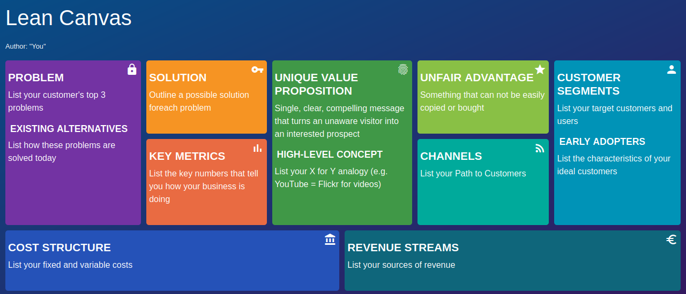

# Lean Canvas

Html template for **Lean Canvas** method. Use this to create your Lean Canvas board.

This is based on this Youtube video: [Lean Canvas Intro - Uber example 🚘](https://www.youtube.com/watch?v=pvIN9STpzCQ)

## Usage

To use it just `git clone` it, `cd` into project directory and then run `npm start` or open `index.html` as it is.

The template can be seen in `localhost:3000`. Hostname and port can be changed as desired.

To edit it open the `index.html` and insert your text where `<!-- Text Here  -->` is listed.

## Images

